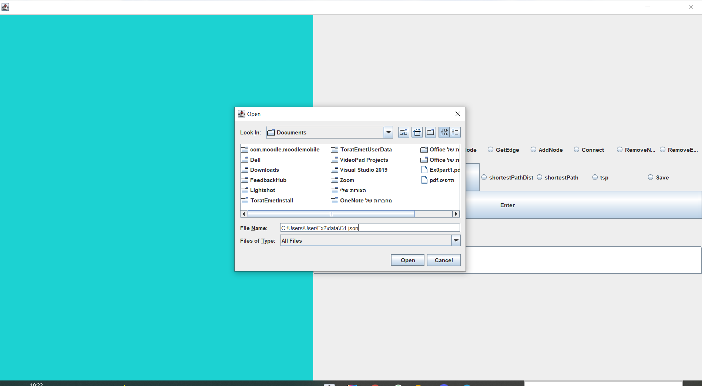
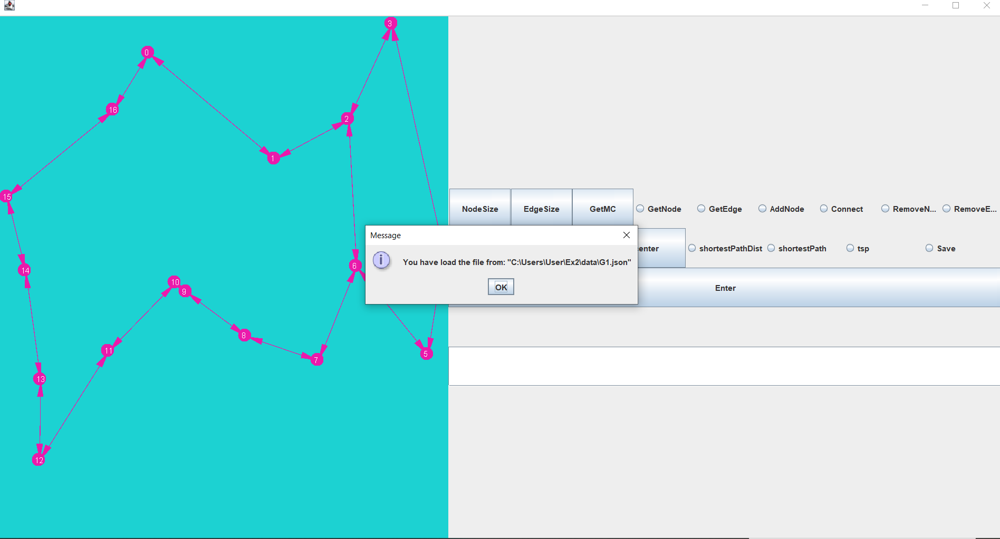
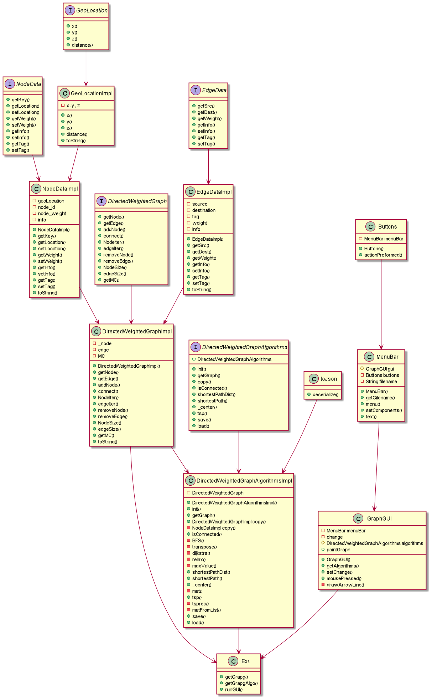
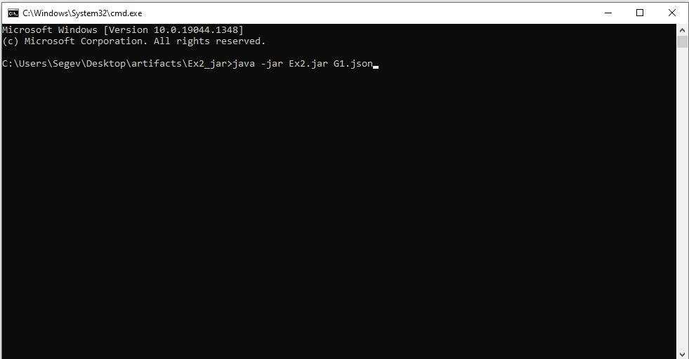
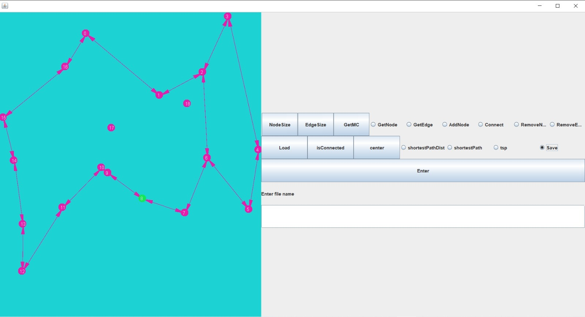

# Ex2 Directed Weighted Graphs Algorithms
java

In this assignment we made directed weighted graphs and implemented on them some algorithms including famous algorithm and computer science problems,
including Traveler Salesman Problem, BFS and Dijkstra's algorithm.

## Our research:

Before starting to implement the algorithms we read about directed weighted graph and algorithm about them.
A very useful algorithm that we already met in other courses like System Programming and Algorithms part 1 for directed weighted graphs is Dijkstra's Algorithms  
https://en.wikipedia.org/wiki/Dijkstra%27s_algorithm  
In case that we will want to run on a graph we would need special algorithm to do it, There are two ways to do it properly: 
BFS: https://en.wikipedia.org/wiki/Breadth-first_search  
DFS: https://en.wikipedia.org/wiki/Depth-first_search  
In the end we decided in the end to use BFS.  

## Directed Weighted Graph Algorithm

An important class that includes the algorithms that can be used on a directed weighted graph 
-**isConnected**: This function checks if a graph is connected by checking if it possible to go from any vertex to another vertex.
the functions use dijkstra to go from a vertex to all the vertices and to see if there is a way to go from one to another.
After using dijkstra we can see if there is untouched vertex in the graph therefore the graph is not connected.
then if it was connected we transpose the graph and check again if it works again.
The transpose it important because the graph is directed, therefore we need to transpose to see if it connected in both ways.

-**shortestPathDist**: This function computes the shortest path and return real number that represents the sum of all the edges in the path.
To implement this function we used Dijkstra's algorithms to compute all the shortest distances from a source vertex to any vertex on the graph.
Then after using Dijkstra's algorithms on a copy of the graph we ran back from the destination back to the source while computing the sum of each edge from destination to source.

-**shortestPath**: Same function as the previous function but this one returns a list of vertices representing the path from source to destination where each node in the list
represents a vertex by order. To implement this function we used Dijkstra's algorithms to compute all the shortest distances from a source vertex to any vertex on the graph.
Then after using Dijkstra's algorithms on a copy of the graph we ran back from the destination back to the source while adding each vertex from destination to source
to the list and then reversing the list to get it in the right order.

-**center**: This function finds the center of the graph: https://en.wikipedia.org/wiki/Graph_center  
we used Floyd-Warshall algorithm to find the center of the graph.  
https://en.wikipedia.org/wiki/Floyd%E2%80%93Warshall_algorithm  

-**tsp**: Travelling salesman problem- in this function we made a function that computes a route for the travelling salesman.  
https://en.wikipedia.org/wiki/Travelling_salesman_problem  

## GUI
Open the jar and load the graph

after loading G1.json it should look like this

use functions on the graph with the buttons on the right

## UML

## Algorithms running times

the times were taken in my laptop, it can change in any computer

## Running The Program

To run the program open the command prompt in the folder that contains it and type "java - jar " and drag the java artifact (jar) to the command prompt
like in the picture bellow.

 
After running successfully it will look like that:
